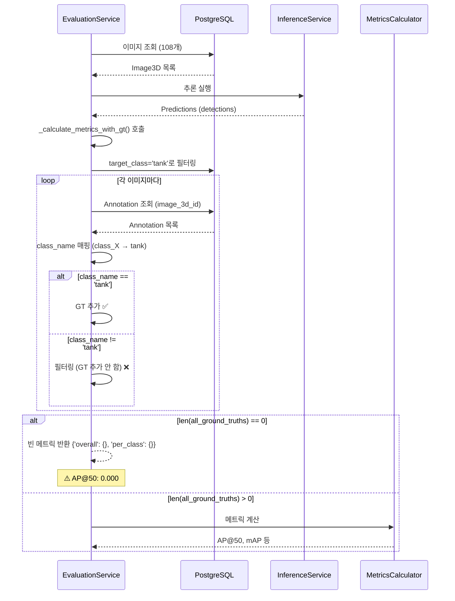

# 3D 데이터셋 평가 문제 분석 및 해결

**날짜**: 2026-01-09
**문제**: 3D 데이터셋 평가 시 AP@50이 0.000으로 나오고 PDF 보고서 생성 실패

---

## 문제 요약

### 발생한 에러
```
[오전 10:29:19] ℹ️ 원본 타겟 클래스 'tank' AP@50: 0.000
[오전 10:29:19] ℹ️ 공격 타겟 클래스 'tank' AP@50: 0.000
[오전 10:29:22] 보고서 생성 실패: float division by zero
```

### 평가 정보
- **원본 데이터셋 ID**: `3f4f3e42-a2a5-4505-a9a8-f3d1e1e256d1`
- **공격 데이터셋 ID**: `637a0210-ce7a-404d-8a6e-f4ecb73f2449`
- **이미지 개수**: 각각 108개
- **타겟 클래스**: `tank`
- **모델**: 추론은 성공적으로 완료됨

---

## 근본 원인 분석

### 1. PDF 보고서 생성 실패 (해결 완료 ✅)

**파일**: `report_generation_service.py:454`

**문제 코드**:
```python
delta_map_percent = ((clean_map - attacked_map) / clean_map) * 100
robustness_ratio = attacked_map / clean_map if clean_map > 0 else 0.0
```

**문제점**:
- 첫 번째 줄에서 `clean_map`이 0일 때 division by zero 발생
- 두 번째 줄은 이미 체크가 있지만, 첫 번째 줄에서 에러가 먼저 발생함

**수정 사항**:
```python
# Division by zero 방지: clean_map이 0이면 비율 계산 불가
if clean_map > 0:
    delta_map_percent = ((clean_map - attacked_map) / clean_map) * 100
    robustness_ratio = attacked_map / clean_map
else:
    delta_map_percent = 0.0
    robustness_ratio = 0.0
```

---

### 2. AP@50이 0.000인 문제 (원인 분석 중 🔍)

**가능한 원인들**:

#### A. Annotation이 DB에 저장되지 않음
**확인 방법**:
```sql
-- 원본 데이터셋의 이미지와 annotation 확인
SELECT i.id, i.file_name, COUNT(a.id) as annotation_count
FROM images_3d i
LEFT JOIN annotations a ON a.image_3d_id = i.id
WHERE i.dataset_id = '3f4f3e42-a2a5-4505-a9a8-f3d1e1e256d1'
  AND i.deleted_at IS NULL
GROUP BY i.id, i.file_name
LIMIT 10;

-- 공격 데이터셋의 이미지와 annotation 확인
SELECT i.id, i.file_name, COUNT(a.id) as annotation_count
FROM images_3d i
LEFT JOIN annotations a ON a.image_3d_id = i.id
WHERE i.dataset_id = '637a0210-ce7a-404d-8a6e-f4ecb73f2449'
  AND i.deleted_at IS NULL
GROUP BY i.id, i.file_name
LIMIT 10;
```

#### B. 클래스명 매칭 문제
**시나리오**:
- CARLA가 annotation을 `car` 또는 `class_0`으로 저장
- 평가 요청에서 `target_class='tank'`로 필터링
- 결과: 모든 GT가 필터링되어 0개가 됨

**확인 방법**:
```sql
-- annotation의 실제 class_name 확인
SELECT DISTINCT a.class_name, COUNT(*) as count
FROM annotations a
JOIN images_3d i ON a.image_3d_id = i.id
WHERE i.dataset_id IN ('3f4f3e42-a2a5-4505-a9a8-f3d1e1e256d1', '637a0210-ce7a-404d-8a6e-f4ecb73f2449')
  AND i.deleted_at IS NULL
GROUP BY a.class_name;
```

#### C. 데이터셋 메타데이터에 class 정보 없음
**코드 위치**: `evaluation_service.py:682`

```python
class_names = self._get_class_names_from_dataset(dataset) if dataset else None
```

**확인 방법**:
```sql
-- 데이터셋 메타데이터 확인
SELECT id, name, metadata_
FROM datasets_3d
WHERE id IN ('3f4f3e42-a2a5-4505-a9a8-f3d1e1e256d1', '637a0210-ce7a-404d-8a6e-f4ecb73f2449');
```

**예상 메타데이터**:
```json
{
  "classes": ["car", "truck", "tank"],  // 이 정보가 있어야 class_0 → car 매핑 가능
  "map_name": "Town03",
  "weather_name": "맑음",
  ...
}
```

#### D. Annotation 폴링 타임아웃
**코드 위치**: `carla_proxy.py:367-408`

**문제**:
- CARLA가 annotations.json을 30초 내에 생성하지 못함
- 타임아웃 시 경고만 출력하고 annotation 파싱을 건너뜀
- 결과: Image3D는 생성되지만 Annotation은 0개

**확인 방법**:
```bash
# 파일 시스템에서 annotations.json 확인
ls -la /home/jaehyun/army_ai/storage/3d/exports/*/annotations/annotations.json
```

---

## 평가 로직 흐름



---

## 해결 방안

### 즉시 해결 (완료 ✅)
1. **PDF 보고서 생성 에러 수정**
   - `report_generation_service.py:454` 수정
   - clean_map > 0 체크 추가

### 단기 해결 (진행 중 🔧)
2. **DB 데이터 확인**
   - Annotation이 실제로 저장되었는지 확인
   - class_name이 무엇인지 확인
   - 데이터셋 metadata에 classes 정보가 있는지 확인

3. **클래스명 매핑 로그 추가**
   ```python
   # evaluation_service.py:928 근처
   class_name = self._map_class_name(ann.class_name, class_names)
   logger.debug(f"Class mapping: {ann.class_name} → {class_name} (target={target_class})")

   if target_class is None or class_name == target_class:
       all_ground_truths.append(bbox_obj)
   else:
       logger.debug(f"Filtered out: {class_name} != {target_class}")
   ```

4. **GT 0개 경고 강화**
   ```python
   # evaluation_service.py:947
   if len(all_ground_truths) == 0:
       logger.error("No ground truth annotations found - cannot calculate metrics")
       logger.error(f"Checked {len(inference_results)} images")
       logger.error(f"Target class filter: {target_class}")
       logger.error(f"Available class names in dataset: {class_names}")
       # DB 확인을 위한 진단 정보 출력
       if dimension == "3d":
           logger.error(f"Run this query to debug:")
           logger.error(f"SELECT DISTINCT class_name FROM annotations a JOIN images_3d i ON a.image_3d_id = i.id WHERE i.dataset_id = '...'")
   ```

### 중기 해결 (계획 📋)
5. **CARLA annotation 생성 검증**
   - CARLA 백엔드가 annotations.json을 제대로 생성하는지 확인
   - 파일 시스템과 DB 동기화 확인

6. **클래스명 표준화**
   - CARLA가 생성하는 클래스명 확인 (car? tank? class_0?)
   - 데이터셋 메타데이터에 classes 정보 자동 추가
   - 또는 annotation 저장 시 클래스명 변환

7. **Annotation 파싱 재시도 로직**
   ```python
   # 평가 시작 시 annotation이 없으면 재파싱 시도
   if annotation_count == 0:
       logger.warning("No annotations found, attempting to re-parse...")
       await dataset_3d_service.parse_annotations(dataset_id, db)
   ```

---

## 진단 스크립트

```bash
#!/bin/bash
# 3D 평가 문제 진단 스크립트

DATASET_ID="3f4f3e42-a2a5-4505-a9a8-f3d1e1e256d1"

echo "=== 1. 데이터셋 정보 ==="
psql -U postgres -d army_ai -c "
SELECT id, name, metadata_->'classes' as classes
FROM datasets_3d
WHERE id = '$DATASET_ID';
"

echo -e "\n=== 2. 이미지 개수 ==="
psql -U postgres -d army_ai -c "
SELECT COUNT(*) as image_count
FROM images_3d
WHERE dataset_id = '$DATASET_ID' AND deleted_at IS NULL;
"

echo -e "\n=== 3. Annotation 개수 및 클래스 분포 ==="
psql -U postgres -d army_ai -c "
SELECT a.class_name, COUNT(*) as count
FROM annotations a
JOIN images_3d i ON a.image_3d_id = i.id
WHERE i.dataset_id = '$DATASET_ID' AND i.deleted_at IS NULL
GROUP BY a.class_name;
"

echo -e "\n=== 4. 파일 시스템 확인 ==="
STORAGE_KEY=$(psql -U postgres -d army_ai -t -c "
SELECT storage_path FROM datasets_3d WHERE id = '$DATASET_ID';
" | tr -d ' ')
STORAGE_PATH="/home/jaehyun/army_ai${STORAGE_KEY}"

echo "Storage path: $STORAGE_PATH"
ls -la "$STORAGE_PATH/annotations/" 2>/dev/null || echo "Annotations directory not found"

echo -e "\n=== 5. 샘플 Annotation 확인 (첫 3개) ==="
psql -U postgres -d army_ai -c "
SELECT a.class_name, a.bbox_x, a.bbox_y, a.bbox_width, a.bbox_height, i.file_name
FROM annotations a
JOIN images_3d i ON a.image_3d_id = i.id
WHERE i.dataset_id = '$DATASET_ID' AND i.deleted_at IS NULL
LIMIT 3;
"
```

---

## 예상 결과 및 조치

### 케이스 1: Annotation이 DB에 없음
**조치**:
```python
# 수동으로 annotation 파싱
await dataset_3d_service.parse_annotations(dataset_id, db)
```

### 케이스 2: class_name이 'car'로 저장됨 (target_class='tank'와 불일치)
**조치** (3가지 옵션):

**Option A**: 평가 시 target_class를 'car'로 변경
```python
# 프론트엔드에서
target_class = 'car'  # CARLA가 사용하는 실제 클래스명
```

**Option B**: Annotation 저장 시 클래스명 변환
```python
# annotation_parser.py에서
if object_name == "K2 전차":
    class_name = "tank"  # car → tank 변환
```

**Option C**: 데이터셋 메타데이터에 클래스 매핑 추가
```python
dataset.metadata_["classes"] = ["tank"]  # class_0 → tank 매핑
```

### 케이스 3: 데이터셋 메타데이터에 classes 정보 없음
**조치**:
```python
# CARLA 백엔드에서 데이터셋 생성 시 classes 정보 추가
metadata = {
    "classes": ["tank"],  # 또는 ["car"]
    "map_name": "Town03",
    ...
}
```

---

## 수정 파일

### 1. report_generation_service.py (✅ 완료)
- **Line 454-460**: Division by zero 방지

### 2. evaluation_service.py (🔧 권장)
- **Line 947-952**: GT 0개 경고 강화
- **Line 928**: 클래스 매핑 디버그 로그 추가

### 3. carla_proxy.py (📋 선택)
- Annotation 폴링 타임아웃 시 사용자 알림 개선

---

## 테스트 체크리스트

- [ ] DB에서 annotation 데이터 확인
- [ ] class_name 확인 (car? tank? class_0?)
- [ ] 데이터셋 metadata 확인
- [ ] PDF 보고서 생성 재테스트 (clean_map=0일 때)
- [ ] target_class 수정 후 평가 재실행
- [ ] Annotation 파싱 로그 확인

---

**작성자**: Claude Code Analysis
**상태**: 1차 수정 완료, 진단 중
**다음 단계**: DB 데이터 확인 및 클래스명 매핑 검증
